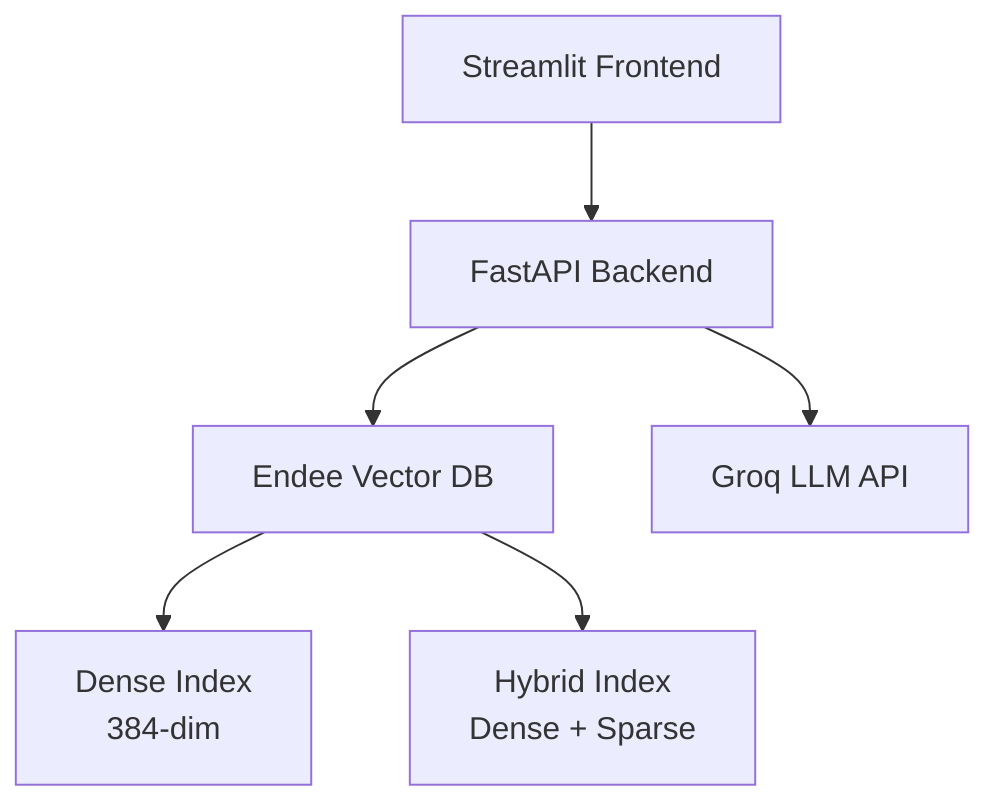

# AI Research Assistant with Endee Vector Database

[](https://www.python.org/downloads/)
[](https://fastapi.tiangolo.com/)
[](https://streamlit.io/)
[](https://opensource.org/licenses/MIT)

AI Research Assistant platform showcasing **Endee Vector Database** capabilities with semantic search, RAG (Retrieval-Augmented Generation).

## Features

- **Semantic Search** - Intelligent search using natural language understanding
- **RAG Assistant** - Conversational AI with citations from research papers
- **Hybrid Search** - Combines dense and sparse vectors for optimal results
- **Autocomplete** - Real-time query suggestions (Powered by Endee Sparse Indexing)
- **Docker Compose** - One-command deployment with all services

## Architecture



## Quick Start

### Prerequisites

- Docker & Docker Compose
- Groq API Key ([Get one here](https://console.groq.com/))
- 8GB+ RAM recommended

### Installation

1. **Clone the repository**
```bash
git clone https://github.com/allwin107/endee-research-assistant.git
cd endee-research-assistant
```

2. **Set up environment variables**
```bash
cp .env.example .env
# Edit .env and add your GROQ_API_KEY
```

3. **Start all services**
```bash
docker-compose up -d
```

4. **Access the applications**
- **Streamlit Dashboard**: http://localhost:8501
- **FastAPI Docs**: http://localhost:8000/docs
- **Endee UI**: http://localhost:8080

### Initial Setup

5. **Create Endee indexes**
```bash
python scripts/setup_endee.py
```

6. **Ingest sample data** (optional)
```bash
python scripts/ingest_data.py --input-file data/raw/arxiv_papers.csv --num-papers 1000
```

## Tech Stack

| Component | Technology | Purpose |
|-----------|-----------|---------|
| **Vector Database** | Endee | Dense & hybrid vector search |
| **LLM** | Groq API (Llama 3.3 70B) | Answer generation |
| **Embeddings** | sentence-transformers | Text-to-vector conversion |
| **Backend** | FastAPI | REST API |
| **Frontend** | Streamlit | Interactive dashboard |
| **Containerization** | Docker Compose | Service orchestration |

## How Endee is Used

This project demonstrates **3 major use cases** of Endee Vector Database:

### 1. Semantic Search
- **Index**: `research_papers_dense` (384-dim, cosine, INT8D)
- **Use Case**: Find papers by meaning, not keywords
- **Features**: Metadata filtering, top-K retrieval, similarity scores

### 2. RAG (Retrieval-Augmented Generation)
- **Index**: `research_papers_dense` for context retrieval
- **Use Case**: Answer questions with citations
- **Features**: Multi-turn conversations, source tracking, context assembly

### 3. Hybrid Search
- **Index**: `research_papers_hybrid` (dense 384-dim + sparse 30K-dim)
- **Use Case**: Combine semantic + keyword search
- **Features**: Dynamic weight balancing (α, β), query type detection

## API Documentation

### Search Endpoints

```bash
# Semantic Search
POST /api/v1/search/semantic
{
  "query": "transformer models for NLP",
  "top_k": 10,
  "filters": {"year": {"$gte": 2020}}
}

# Hybrid Search
POST /api/v1/search/hybrid
{
  "query": "attention mechanisms",
  "top_k": 10,
  "alpha": 0.7,
  "beta": 0.3
}
```

### RAG Endpoints

```bash
# Ask Question
POST /api/v1/rag/ask
{
  "question": "What are transformers in NLP?",
  "top_k": 5,
  "temperature": 0.7
}
```
API documentation: http://localhost:8000/docs

## Testing

```bash
# Install dependencies
pip install -r requirements.txt

# Run all tests
pytest

# Run with coverage
pytest --cov=backend --cov-report=html

# Run specific test categories
pytest -m unit
pytest -m integration
```

## Project Structure

```
endee-research-assistant/
├── backend/              # FastAPI backend
│   ├── api/             # API routes and models
│   ├── core/            # Core services (Endee, embeddings, RAG)
│   └── utils/           # Utilities (logging, caching)
├── frontend/            # Streamlit frontend
│   ├── pages/          # Dashboard pages
│   └── app.py          # Main app
├── scripts/            # Setup and ingestion scripts
├── tests/              # Unit and integration tests
├── docs/               # Documentation
├── data/               # Data storage
└── docker-compose.yml  # Service orchestration
```

## Configuration

Key environment variables in `.env`:

```bash
# Required
GROQ_API_KEY=your_groq_api_key

# Endee
ENDEE_URL=http://localhost:8080

# Optional
LOG_LEVEL=INFO
CACHE_SIZE=1000
```

## Contributing

Contributions are welcome! Please see [CONTRIBUTING.md](docs/CONTRIBUTING.md) for guidelines.

## License

This project is licensed under the MIT License - see [LICENSE](LICENSE) file for details.

## Acknowledgments

- **Endee** for the powerful vector database
- **Groq** for fast LLM inference
- **Hugging Face** for sentence-transformers
- **FastAPI** and **Streamlit** communities

## Contact

- **GitHub**: [@allwin107](https://github.com/allwin107)
- **Email**: allwin10raja@gmail.com
- **Documentation**: [Full Docs](docs/README.md)

---

**Built with ❤️ for the Endee ML Internship Selection Process**
